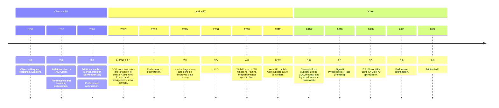
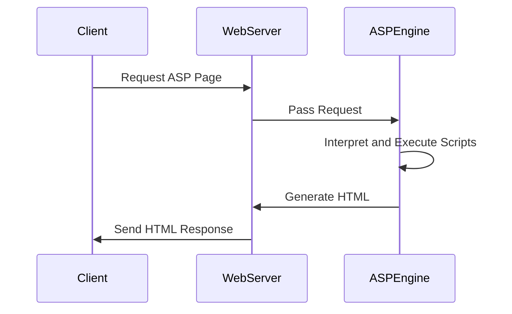

# Modern web architecture

Source: [Microsoft Learn](https://learn.microsoft.com/en-gb/training/)

## Table of contents

<!--TOC-->
  - [Monolithic vs microservices](#monolithic-vs-microservices)
  - [ASP timeline](#asp-timeline)
    - [Classic ASP](#classic-asp)
<!--/TOC-->
## Monolithic vs microservices

A `monolithic` app is an app deployed as a single unit.

Versus an app composed of a collection of different services interacting with each other.

In many cases, monolithic apps are easier to build, deploy and debug versus a microservices-driven app, achieving most business requirements.

## ASP timeline

Active Server Pages.

Microsoft uses the ASP framework for web development, which has evolved several models over the years.



### Classic ASP (.asp)

Like PHP, classic ASP embeds scripts (logic) within HTML code.

Rendering occurs on the server side, via an ASP engine:



It uses VBScript, a light version of Visual Basic:

```aspnet
<!DOCTYPE html>
	<html>
		<body>
			<%
			Response.Write("Hello World!")	
			%>
		</body>
	</html>
```

### ASP.NET (.aspx)